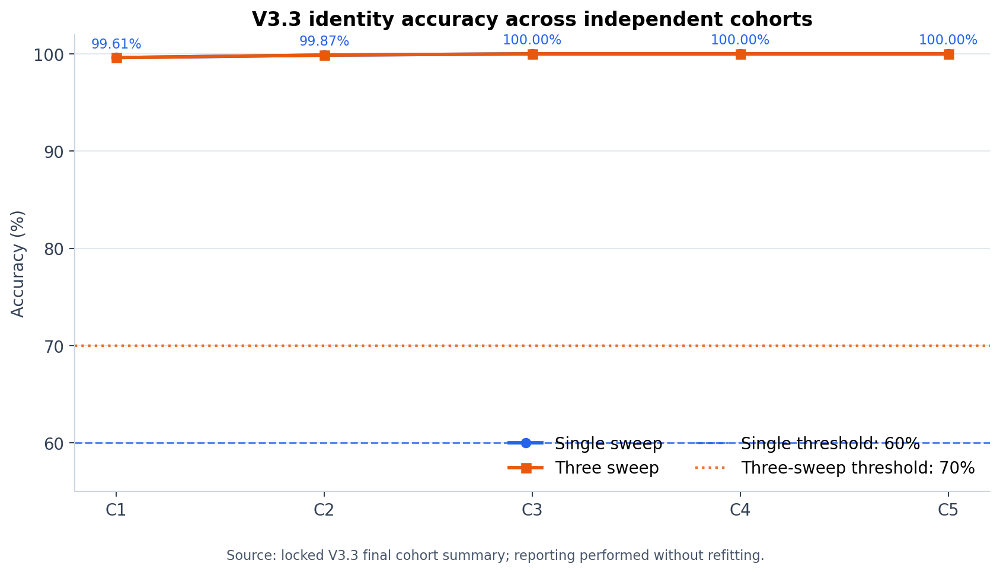
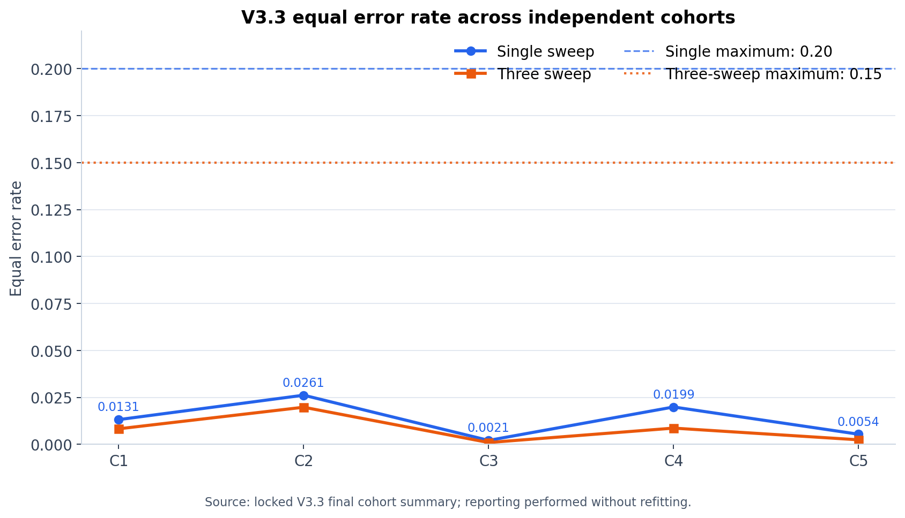
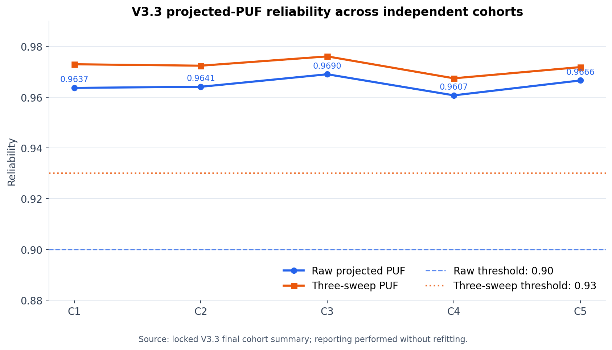
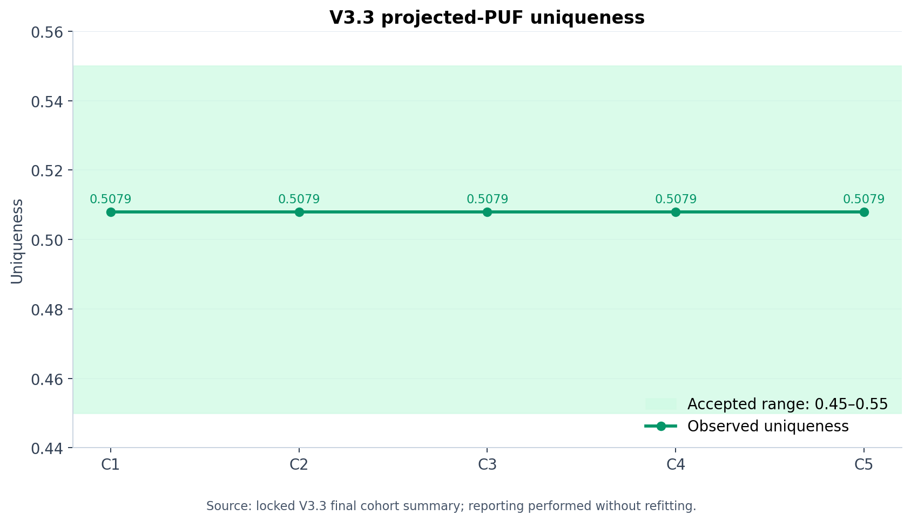
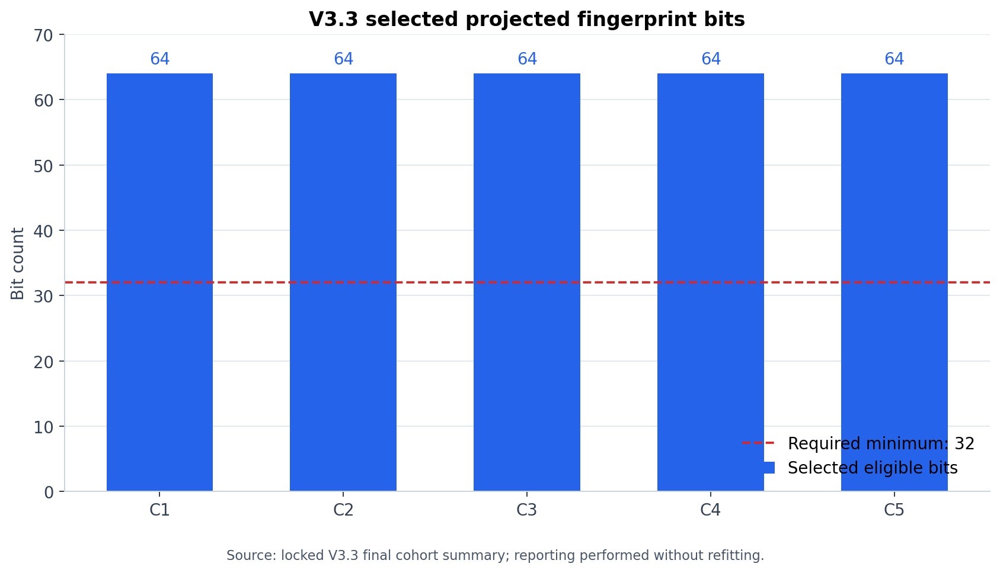
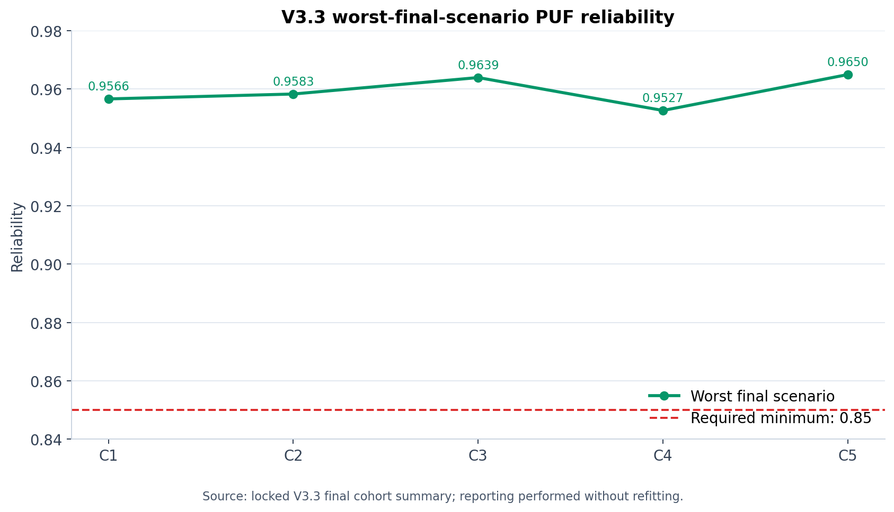
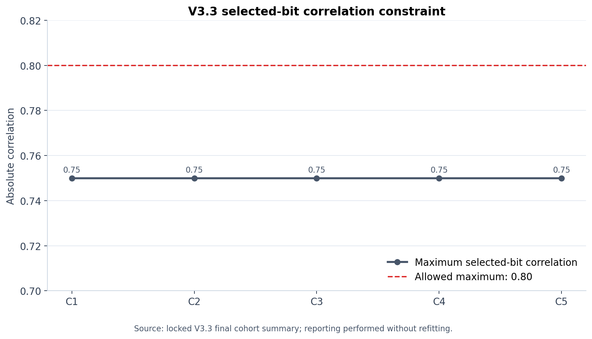

# TrafoDNA V3.3 Locked Final Outcome

## Conclusion

**The preregistered V3.3 independent-population and seed-robustness hypothesis is SUPPORTED.**

All five independently seeded 64-core cohorts passed all ten frozen V3.2 gates. The preregistered aggregate requirement was at least four passing cohorts out of five. All 11,520 locked-final rows were generated and evaluated, and the final audit lock records `COMPLETED`.

This is numerical feasibility evidence inside the same simulator. It is not physical transformer validation, proof of independent 64-bit entropy, or cryptographic certification.

## Aggregate result

| Item | Locked result |
|---|---:|
| Passing cohorts | **5/5** |
| Required passing cohorts | 4/5 |
| Cohort-level gates passed | **50/50** |
| Final rows generated / used | 11,520 / 11,520 |
| Mean identity accuracy | 99.90% |
| Maximum identity EER | 0.0261 |
| Mean raw PUF reliability | 0.9648 |
| Minimum worst-scenario reliability | 0.9527 |
| Mean three-sweep PUF reliability | 0.9721 |
| Final decision | **SUPPORTED** |

## Cohort results

| Cohort | Seed | Final IDs | Identity | EER | Raw PUF | Worst scenario | 3-sweep PUF | Bits | Max corr. | Gates | Result |
|---:|---:|---|---:|---:|---:|---:|---:|---:|---:|---:|:---:|
| 1 | 20260901 | [315 316 317 318] | 99.61% | 0.0131 | 0.9637 | 0.9566 | 0.9730 | 64 | 0.75 | 10/10 | PASS |
| 2 | 20260902 | [415 416 417 418] | 99.87% | 0.0261 | 0.9641 | 0.9583 | 0.9724 | 64 | 0.75 | 10/10 | PASS |
| 3 | 20260903 | [515 516 517 518] | 100.00% | 0.0021 | 0.9690 | 0.9639 | 0.9761 | 64 | 0.75 | 10/10 | PASS |
| 4 | 20260904 | [615 616 617 618] | 100.00% | 0.0199 | 0.9607 | 0.9527 | 0.9674 | 64 | 0.75 | 10/10 | PASS |
| 5 | 20260905 | [715 716 717 718] | 100.00% | 0.0054 | 0.9666 | 0.9650 | 0.9718 | 64 | 0.75 | 10/10 | PASS |

## Frozen acceptance gates

The observed column reports the worst cohort value for one-sided gates and the full observed range for uniqueness.

| Criterion | Requirement | Worst observed | Result |
|---|---:|---:|:---:|
| Single-sweep identity accuracy | >= 0.60 | 0.996094 | PASS |
| Single-sweep identity EER | <= 0.20 | 0.026148 | PASS |
| Raw projected-PUF reliability | >= 0.90 | 0.960714 | PASS |
| Projected-PUF uniqueness | 0.45–0.55 | 0.507937–0.507937 | PASS |
| Strictly eligible projected bits | >= 32 | 64 | PASS |
| Worst-final-scenario PUF reliability | >= 0.85 | 0.952664 | PASS |
| Three-sweep identity accuracy | >= 0.70 | 0.996094 | PASS |
| Three-sweep identity EER | <= 0.15 | 0.019748 | PASS |
| Three-sweep PUF reliability | >= 0.93 | 0.967428 | PASS |
| Maximum selected-bit correlation | <= 0.80 | 0.750000 | PASS |

## Figures

## Integrity record

| Artifact | SHA-256 |
|---|---|
| Prepared V3.3 bundle | `6d4a477b8a7aad13cd38e8ce6d2be3e3b519fe169703110a719e66b82e0ba9f4` |
| Preparation archive | `fb1ba4f2c1fb56dfafedb54c7a7f54ae63f04af866a31eb30df0b14afd4973e9` |
| Locked final MAT result | `9b3ff468dccbd9ca0654582f3d3f52f6f88413cf599dc46d30282e5e0aa7effb` |
| Locked final archive | `389fbb2491a5f378ca47a3497bef8ec66fd333c4dabdf19bd7ad3382c3ea7754` |
| Frozen source package | `f4f3ad6ad07c5c1860a26cd8ed241042127dd420da7da0b7e5357ab1715aaba5` |

The report generator reproduced the 5/5 decision directly from the archived final cohort CSV and verified the final MAT hash against `V33_FINAL_FREEZE.txt`. No model fitting, threshold change, candidate selection, or final-row generation occurred during reporting.

## Interpretation boundary

V3.3 shows that the frozen V3.2 algorithm passed on five new independently seeded virtual populations and five disjoint Halton condition blocks. This materially strengthens simulator-level robustness relative to the single-population V3.2 result.

The identical uniqueness value (`0.5079365`) across cohorts is compatible with the balanced 64-core enrollment construction. It should not be interpreted as proof that the selected 64 bits contain 64 independent bits of entropy. Physical repeatability, manufacturing variation, adversarial modeling resistance, helper-data behavior, and cryptographic key extraction remain untested.
